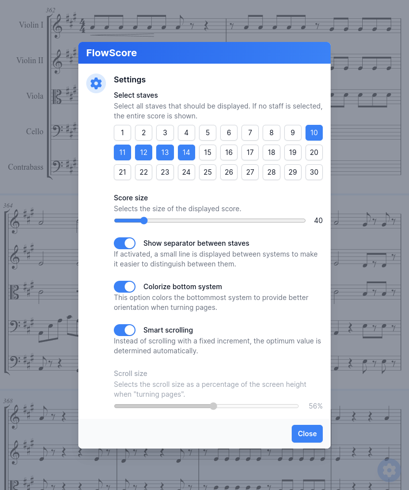

# FlowScore
FlowScore is a web-based score viewer app that enables real-time reception, rendering, and display of musical material on digital music stands.



## Contributors

- Ideator and Conceptual Advisor: [Prof. Dr. Axel Berndt](https://github.com/axelberndt)
- Lead Developer and Project Author: [Simon Waloschek](https://github.com/sonovice)

## 💡 Concept
This project aims to provide a streaming-based solution, divided into three main components: Provider, Server, and Client:

- Provider: Sends musical material to the host. This part is developed externally. (A naive provider that streams MEI files can be found in the /tests folder.)
- Server: Receives musical material from the Music Provider, generates voice parts, and sends them to the clients.
- Client: The client application is accessed by musicians on their devices via a browser. It offers various settings and the display of musical scores.

## 🏎 Run server
To run the server, simply download and execute the binary file for your operating system from the [Releases](https://github.com/sonovice/flowscore/releases) page. The server will start on port 8765 by default.

For now the CLI options are restricted to selecting a custom port:
```
$ ./FlowScore
FlowScore server v1.0.2
    Usage: ./FlowScore [OPTIONS]
    Options:
     --port      Set custom port number. Default is 8765.
```

Clients then have to connect to the given IP/Port via HTTP, e.g. `http://192.168.1.1:8765/`.

## 📋 Notes for Providers
- **WebSocket Connection**: Connect to the Server at `ws://[IP]:[Port]/ws?type=provider` using the WebSocket protocol. This connection is used for exchanging data between your provider and the main system.

- **Responsibility for Reconnects**: As a provider, you are responsible for maintaining your connection. If the connection to the WebSocket server is interrupted for any reason, you must ensure that your provider can automatically reconnect. Therefore, implement a reliable reconnect logic to ensure the stability and reliability of your services.

- **Data Format**: Ensure that all MEI data you submit is valid.

- **Inclusion of Labels**: When transmitting MEI data, it is important to include the `@label` and `@label.abbr` attributes in `<scoreDef>` elements **for each MEI snippet**.

- **Ignoring MEI header**: Note that the server ignores the `<meiHead>` part of the MEI data. This means that any information provided in this section will not be processed or considered.

- **Examples**: See the `examples/` directory for provider examples in Python and Java.

<sub>The development of FlowScore is supported by KreativInstitut.OWL, a consortium consisting of OWL University of Applied Sciences and Arts, Detmold University of Music, and Paderborn University, funded by the Ministry of Economic Affairs, Industry, Climate Action and Energy of the State of North Rhine-Westphalia, Germany.</sub>
